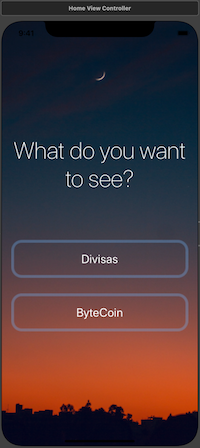
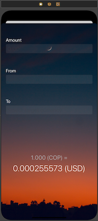
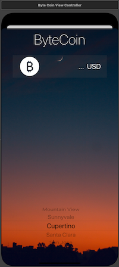

# Divisas
iOS App Native to convert currencies

Applying the concepts:

* SF Symbols
* Protocols and Delegate Dessing Pattern
* Call APIs by making HTTP request with URLSession
* JSONDecoder

# Functionality
A Divisas app gives you two options: The first one give you the latest Bitcoin prices in 21 the popular currencies with Bitcoin price ticker.
The second one give you option of calculate all currencies and all exchange rates.
Both options in real time

## Screenshots

|  Home      |  Divisas      |  ByteCoin      |
|------------|-------------|------------|
|  |    |  |
